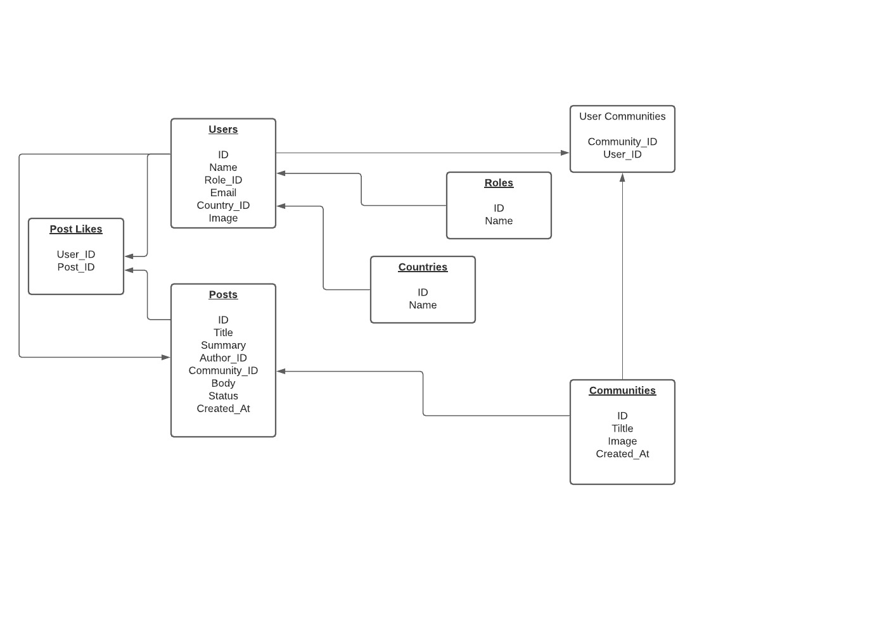

# Social Service

This project has the following features:

- API to add new posts, and get recommended feeds
- Diagnostic service for watchlist and email alert
- RabbitMQ for communicating between API and Diagnostic
- MySQL with optimized tables to speed up data performance
- Integration test using mocha for testing and migrating tables and data into MySQL
- All apps (including integration test) has **nodemon** - implemented for easily change and restart with new changes

## Database Architecture


## Start service

```
$ docker-compose up
```
## API Documentation
http://localhost:3008/v1/docs

## RESTful Request

### URL Example

```
http://localhost:3008/api/v1/feeds
```

### Header

We are using a dummy authorization using the basic auth.
To keep it simple for testing, there's only a need to provide the userId (1 in example below) for receiving only relevant details for the given user

Authorization:

```
Basic 1
```

## Debug

Add the following code in `.vscode/launch.json`

```JSON
{
  "version": "0.2.0",
  "configurations": [
    {
      "name": "Social Docker",
      "type": "node",
      "request": "attach",
      "port": 5860,
      "address": "localhost",
      "localRoot": "${workspaceFolder}/social-posts/social-api",
      "remoteRoot": "/social-api",
      "protocol": "inspector",
      "sourceMaps": true,
      "restart": true
    }
  ]
}
```

## Services

- Social API (Port 3008)
- Social Diagnostic
- RabbitMQ
- MySQL (Port 3306)
- Integration Test
